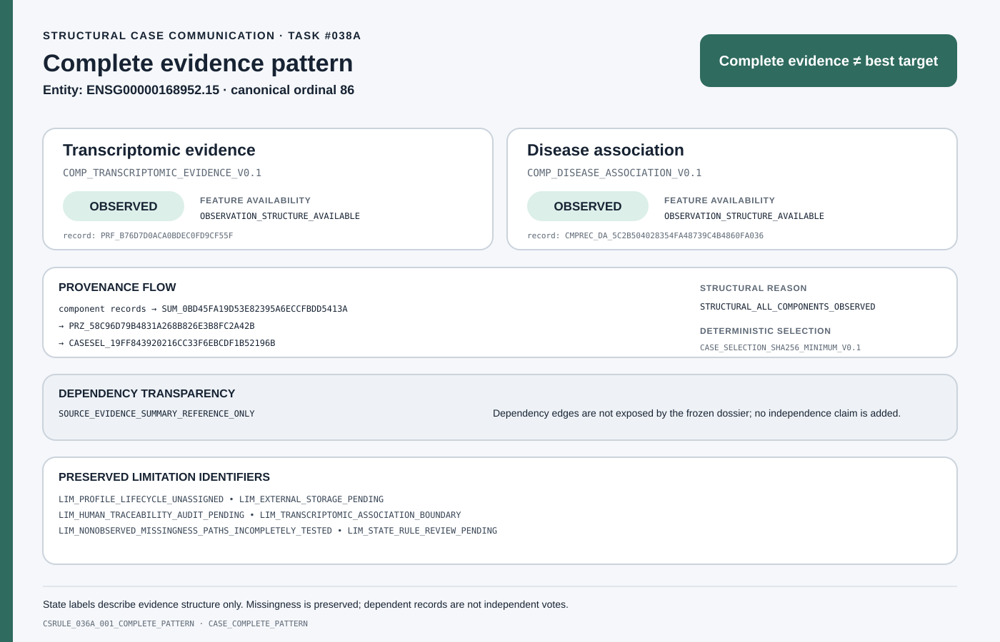
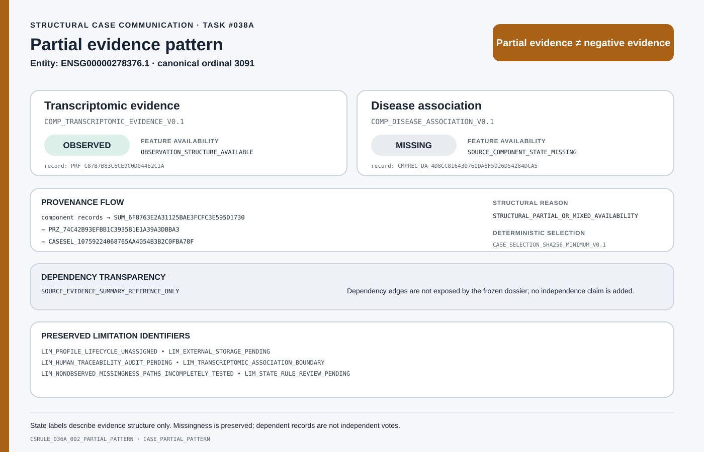
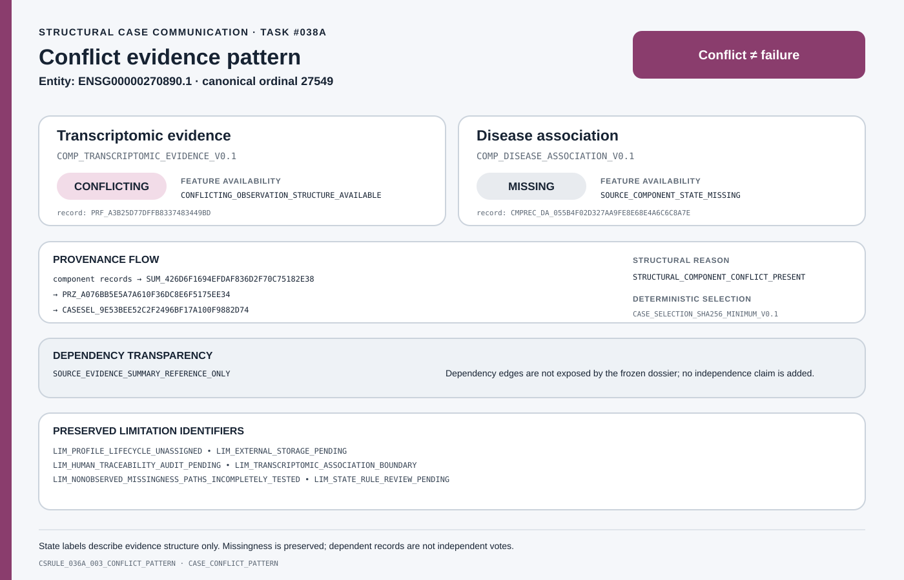
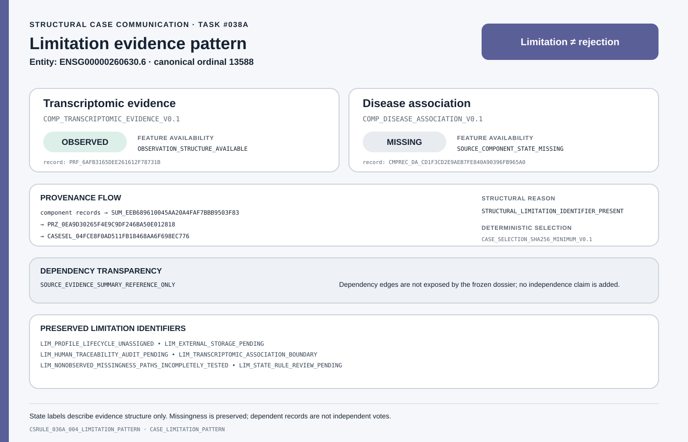

# LUAD Target Evidence Dossier

**A provenance-aware framework for representing heterogeneous LUAD target evidence without converting evidence availability into target quality.**

## Why this project?

Differential expression can reveal tumour-associated molecular changes, but it is not proof that a gene is a therapeutic target. Evidence from different databases may share upstream sources, while absent records may mean `MISSING`, `NOT_FOUND`, or `NOT_QUERIED` rather than biological absence. Compressing these distinctions too early can hide conflict, double-count dependent records, or create misleading certainty. This project therefore organizes evidence before any target-level decision is attempted.

> **How can heterogeneous target evidence be integrated while preserving provenance, missingness, dependency, conflict, and interpretation boundaries?**

## What I built

```text
Transcriptomic evidence
        +
Disease-association evidence
        ↓
Multi-component Evidence Landscape
        ↓
Evidence Summary
        ↓
Non-ordinal Structural Routing
        ↓
Representative Evidence-Pattern Dossiers
```

The framework converts frozen observations into traceable structural representations. This organization does not create new biological evidence or determine which target should be pursued.

## Project at a glance

| Governed layer | Frozen structural result |
|---|---:|
| Entity universe | **29,606** immutable EnsemblID entities |
| Implemented evidence components | **2** |
| Final transcriptomic cohort | **574** biological observations |
| Transcriptomic component states | **26,171 `OBSERVED`** · **3,435 `CONFLICTING`** |
| Disease-association component states | **8,393 `OBSERVED`** · **713 `PARTIAL`** · **20,500 `MISSING`** |
| Joint structural patterns | **7,690** both components observed · **18,481** partial/mixed availability · **3,435** component conflict |
| Artifact Registry v0.1 | **41** records · **38** Git-managed · **3** external immutable references |

These counts describe representation states and artifact scale. They are not measures of evidence strength, target quality, or therapeutic value.

## Representative evidence patterns

The four examples below are deterministic structural representatives selected by the governed Task #036A/#036B process. They contain immutable EnsemblID identities only—no gene-symbol annotation or biological narrative.

<table>
  <tr>
    <td width="50%" valign="top">
      <strong>Complete pattern</strong><br>
      <sub>Complete ≠ best target</sub><br><br>
      
    </td>
    <td width="50%" valign="top">
      <strong>Partial pattern</strong><br>
      <sub>Partial ≠ negative evidence</sub><br><br>
      
    </td>
  </tr>
  <tr>
    <td width="50%" valign="top">
      <strong>Conflict pattern</strong><br>
      <sub>Conflict ≠ failure</sub><br><br>
      
    </td>
    <td width="50%" valign="top">
      <strong>Limitation pattern</strong><br>
      <sub>Limitation ≠ rejection</sub><br><br>
      
    </td>
  </tr>
</table>

The figures expose component states, state-derived feature availability, provenance references, missingness, and preserved limitations; dependency detail remains governed upstream and is referenced rather than reconstructed here. See the [case-study communication specification](docs/case_study_communication_specification_v0.1.md) for the exact communication contract.

## What the framework preserves

- immutable EnsemblID identity;
- component and feature states;
- evidence-record provenance;
- source, snapshot, schema, and generator versions;
- dependency relationships and independence boundaries;
- explicit missingness semantics;
- limitation identifiers;
- deterministic rule traces.

## Reproducibility

The computational lifecycle is governed through versioned artifacts, frozen inputs, SHA256 integrity checks, deterministic regeneration, and explicit references to externally stored immutable payloads.

- [Reproducibility Report v0.1](docs/reproducibility_report_v0.1.md) defines what is computationally reproducible and what is not claimed.
- [Artifact Registry v0.1](outputs/artifact_registry_v0.1/artifact_registry.csv) records artifact identity, version, provenance, dependencies, storage class, size, and SHA256.
- Git-managed artifacts are validated directly; three large payload sets remain represented by immutable metadata references rather than copied into Git.
- Validation fails closed when frozen identity, lineage, state, schema, or artifact integrity changes unexpectedly.

## Interpretation boundaries

- **DE is not target proof.** Association does not establish causality or actionability.
- **Evidence representation is not ranking.** Structural availability does not establish comparative target quality.
- **Missing evidence is not negative evidence.** Missing, not-found, and not-queried states retain different meanings.
- **Routing categories are not priorities.** They are non-ordinal structural outcomes.
- **Computational validation is not biological validation.** Reproducible bytes and valid schemas do not demonstrate efficacy, safety, or clinical benefit.

This repository is not a clinical decision tool or a system for selecting or recommending targets.

## Documentation and communication

- [Project Overview v1.0](docs/project_overview_v1.0.md)
- [Reproducibility Report v0.1](docs/reproducibility_report_v0.1.md)
- [Release Notes v1.1](docs/release_notes_v1.1.md)
- [Scientific Specification v0.1](docs/scientific_spec_v0.1.md)
- [Case-study Communication Specification v0.1](docs/case_study_communication_specification_v0.1.md)
- [Architecture summary](outputs/presentation_artifacts_v0.1/architecture_summary.md)
- [Evidence-layer summary](outputs/presentation_artifacts_v0.1/evidence_layer_summary.csv)
- [Case-pattern summary](outputs/presentation_artifacts_v0.1/case_pattern_summary.csv)
- [Provenance-flow summary](outputs/presentation_artifacts_v0.1/provenance_flow_summary.md)

Documentation v1.1 is a forward-only public-facing maintenance release. The validated v1.0 documentation and Task #038A communication manifests remain unchanged historical records.
